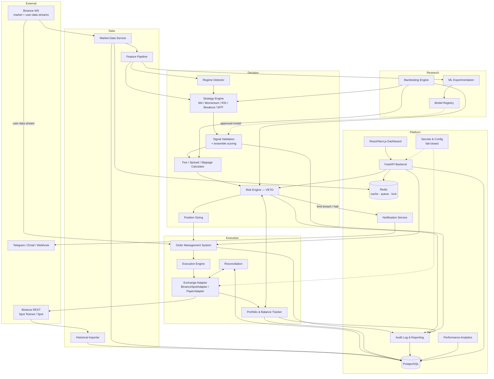

# Architecture — CryptoBot

> BMAD Phase: **Architect → Architecture Document** · Draft v1.0 · 2026-08-01
> Upstream: `brief.md`, `prd.md`

---

## 1. Architectural principles

1. **Risk has veto authority.** Strategies propose; validation, cost gate, and risk engine dispose.
2. **One strategy/risk interface, three execution paths.** Backtest, paper, testnet/live all consume identical `Strategy` and `RiskEngine` interfaces — what is tested is what runs.
3. **Exchange behind an adapter.** Nothing outside `exchange/` knows it is talking to Binance.
4. **Never trust the happy path.** Idempotent orders, reconciliation on every restart/disconnect, fail-closed everywhere.
5. **Everything auditable.** Signals, rejections, orders, fills, config changes → append-only records.
6. **Modular monolith first.** One deployable backend with strict internal module boundaries; extract services only when a real scaling need appears. Redis used only for tick cache, event queue, and the single-instance lock.

## 2. System diagram



## 3. Component responsibilities

| # | Module | Responsibility |
|---|--------|----------------|
| 1 | **market_data** | WS subscriptions (kline/trade/depth), staleness detection, reconnect + backfill, tick cache (Redis), candle persistence |
| 2 | **importer** | Historical kline download, gap/duplicate validation, chronological storage |
| 3 | **features** | Versioned indicator computation (returns, MA, RSI, MACD, ATR, BB position, volume Δ, realized vol, momentum, spread, depth, book imbalance where reliable, time-of-day, BTC correlation, market direction); leakage-safe (uses only data available at bar close) |
| 4 | **strategies** | `Strategy` interface + 5 baselines; each declares regimes it must NOT trade |
| 5 | **signal_validation** | Data-quality checks, regime fit, confidence threshold, ensemble scoring requiring confirmation; emits `NO_TRADE` with reasons |
| 6 | **risk** | All limits in risk-policy.md; absolute veto; halt states; reason-coded rejections |
| 7 | **sizing** | Risk-%-based size from stop distance; filter-compliant rounding (step size, min qty, min notional) |
| 8 | **oms** | Order lifecycle state machine, unique client order IDs, duplicate prevention, partial-fill tracking |
| 9 | **execution** | Policy (market vs limit), pre-trade slippage estimate from depth, limit-order TTL + cancel/replace, final-state confirmation from exchange |
| 10 | **portfolio** | Balances, positions, exposure, realized/unrealized PnL; recompute per fill; sell ≤ available balance |
| 11 | **costs** | Maker/taker fees, spread, slippage model, market impact, rounding losses; conservative expected-cost estimates for the cost gate |
| 12 | **backtest** | Event-driven simulator sharing strategy/risk/cost interfaces; walk-forward; baseline comparisons; full metric report |
| 13 | **paper** | `PaperAdapter`: simulated fills against live data using the same cost model; persistent paper account |
| 14 | **ml** | Experimentation framework, chronological splits, walk-forward CV, seeds |
| 15 | **ml/registry** | Model + feature versioning, promotion gates, champion/challenger comparison |
| 16 | **analytics** | Sharpe/Sortino/expectancy/drawdown/regime breakdowns; EOD reports |
| 17 | **notifications** | Alert routing (Telegram/email/webhook), dedup/throttling |
| 18 | **security** | Secrets loading (env / secrets manager), redaction filter, live-gate enforcement, key-rotation procedure |
| 19 | **dashboard** | Next.js UI over FastAPI; auth; confirmed high-risk controls |
| 20 | **audit** | Append-only event records; config versioning; report generation |

## 4. Exchange adapter interface (sketch)

```python
class ExchangeAdapter(Protocol):
    async def get_exchange_info(self) -> ExchangeInfo: ...
    async def get_server_time(self) -> datetime: ...
    async def get_account(self) -> AccountState: ...
    async def get_order_book(self, symbol: Symbol, limit: int) -> OrderBook: ...
    async def get_klines(self, symbol: Symbol, interval: Interval,
                         start: datetime, end: datetime) -> list[Candle]: ...
    async def place_order(self, req: OrderRequest) -> OrderAck:      # req.client_order_id required
        ...
    async def cancel_order(self, symbol: Symbol, client_order_id: str) -> OrderState: ...
    async def query_order(self, symbol: Symbol, client_order_id: str) -> OrderState: ...
    async def open_orders(self, symbol: Symbol | None) -> list[OrderState]: ...
    def market_stream(self, subs: list[Subscription]) -> AsyncIterator[MarketEvent]: ...
    def user_stream(self) -> AsyncIterator[UserEvent]: ...
```

Implementations: `BinanceSpotAdapter` (testnet/live via config-selected base URL + credentials) and `PaperAdapter` (backed by simulator). A future exchange = new adapter, zero changes elsewhere.

**Binance-specific behaviors inside the adapter:** time sync before signing; client-side rate limiter fed by `exchangeInfo` limits and response headers; 429/418 handling with `Retry-After`; exponential backoff + jitter; WS reconnect + resubscribe + REST gap backfill; listen-key keepalive; secret redaction. *All endpoints verified against current official Binance Spot API docs at implementation time (Phase 2) — none invented.*

## 5. Folder structure

```
cryptobot/
├── docs/                        # BMAD docs (this set), ADRs, runbooks
│   └── adr/
├── backend/
│   ├── pyproject.toml           # deps, ruff, mypy, pytest config
│   ├── alembic/                 # DB migrations
│   └── src/cryptobot/
│       ├── config/              # Pydantic Settings; mode gating; config versioning
│       ├── security/            # secrets loading, redaction, live gate, key rotation docs
│       ├── exchange/            # ExchangeAdapter, BinanceSpotAdapter, PaperAdapter, rate limiter, time sync
│       ├── market_data/         # WS manager, staleness monitor, candle store
│       ├── importer/            # historical kline importer + validation
│       ├── features/            # indicator library, feature versioning
│       ├── regime/              # market-regime detection
│       ├── strategies/          # base.py + one module per strategy
│       ├── signal_validation/   # ensemble scoring, confidence gate
│       ├── risk/                # limit engine, halt manager, reason codes
│       ├── sizing/              # position sizing + filter rounding
│       ├── costs/               # fee/spread/slippage/impact models
│       ├── oms/                 # order state machine, idempotency
│       ├── execution/           # execution policies, TTL, cancel/replace
│       ├── portfolio/           # balances, positions, PnL
│       ├── reconciliation/      # startup/disconnect reconciliation
│       ├── backtest/            # event loop, fill simulator, walk-forward, reports
│       ├── ml/                  # experiments/, training/, registry/, drift/
│       ├── analytics/           # metrics, EOD report builder
│       ├── notifications/       # channels, throttling
│       ├── audit/               # append-only event writer
│       ├── api/                 # FastAPI app, routers, auth, schemas
│       ├── db/                  # SQLAlchemy models, session, repositories
│       └── app/                 # composition root, DI container, daily workflow orchestrator, CLI
├── dashboard/                   # Next.js app
├── tests/
│   ├── unit/
│   ├── integration/             # DB + Redis + mocked exchange
│   ├── testnet/                 # real Testnet E2E (separate, opt-in)
│   └── property/                # Hypothesis: sizing & filter math
├── infra/
│   ├── docker-compose.yml       # api, worker, postgres, redis, dashboard
│   └── ci/                      # lint, type-check, test pipeline
├── .env.example                 # placeholders only — never real secrets
├── .gitignore                   # includes .env
└── README.md                    # disclaimer + quickstart
```

## 6. API design (FastAPI, `/api/v1`)

Auth: session/JWT for the single operator; high-risk endpoints additionally require a confirmation token issued server-side (two-step). All mutations audited.

| Method | Path | Purpose |
|--------|------|---------|
| GET | `/health` | liveness/readiness (DB, Redis, WS, time-sync status) |
| GET | `/status` | mode, bot state, halt reasons, connection health |
| GET | `/balances` · `/positions` · `/orders?state=` · `/fills` | portfolio views |
| GET | `/pnl/daily` · `/pnl/cumulative` · `/drawdown` | performance |
| GET | `/signals?since=` | signals incl. rejected + reason codes |
| GET | `/risk/limits` · `/risk/utilization` · `/risk/events` | risk state |
| GET | `/strategies` · PATCH `/strategies/{id}` | enable/disable, params (versioned) |
| GET | `/models` · `/models/active` | registry views |
| GET | `/reports/daily/{date}` | EOD report |
| GET | `/config` · GET `/config/history` | current + versioned config |
| POST | `/controls/pause` · `/controls/resume` | needs confirmation token; resume after limit-halt requires review ack |
| POST | `/controls/emergency-stop` | cancel all open orders, disable trading; confirmation token |
| GET | `/audit?filter=` | audit trail |

WebSocket `/ws/updates` pushes status, fills, PnL, and alerts to the dashboard.

## 7. Execution policy: market vs limit (trade-offs)

- **Market orders**: certain, immediate fill; pay taker fee + spread + slippage; slippage unbounded in thin books. Used for exits under stop-loss/emergency conditions where certainty dominates cost.
- **Limit orders**: maker fee (often lower), price control, zero slippage beyond the limit; but may not fill → opportunity cost, adverse selection (fills happen more when price moves against you), and stale-order risk. Default for entries, with TTL and controlled cancel/replace; unfilled entry = acceptable outcome (no chase rule beyond configured bounds).

The policy is configurable per strategy and order role (entry / exit / stop), and the cost gate uses the policy's conservative cost estimate.

## 8. Key architectural decisions (ADR summaries)

- **ADR-001 Modular monolith over microservices** — one operator, one box; boundaries enforced in code; cheaper ops, simpler reconciliation.
- **ADR-002 PostgreSQL as source of truth; Redis auxiliary only** — ticks cache, queue, instance lock. Loss of Redis degrades, never corrupts.
- **ADR-003 Event-driven backtester shares production interfaces** — eliminates backtest/live behavioral divergence, the classic source of fake alpha.
- **ADR-004 `Decimal`/`NUMERIC` everywhere for money/qty** — float rounding breaks Binance filters and hides losses.
- **ADR-005 Client order ID = idempotency key** — deterministic ID from (signal id, attempt); on ambiguity, query before retry.
- **ADR-006 Live gate is code + config + credentials** — live mode requires all of: `live` config file present, distinct live API keys, `CONFIRM_LIVE_TRADING=I_UNDERSTAND_THE_RISKS` env var, graduation-criteria record in DB, and CLI confirmation. Absence of any → paper mode.
