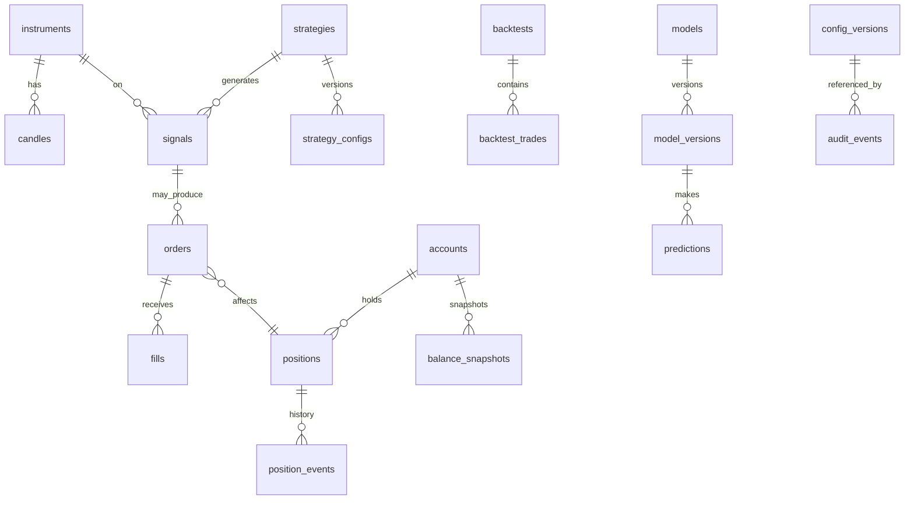

# Database Design — CryptoBot

> Draft v1.0 · 2026-08-01 · PostgreSQL 16, SQLAlchemy 2.x + Alembic
> Conventions: UTC timestamps (`timestamptz`), money/qty as `NUMERIC(38,18)`, UUID PKs unless noted, append-only tables never updated/deleted.

## 1. Entity overview



## 2. Tables

### Market data
```sql
instruments (
  id uuid PK, symbol text UNIQUE,            -- 'BTCUSDT'
  base_asset text, quote_asset text,
  tick_size numeric, step_size numeric,
  min_qty numeric, min_notional numeric,
  filters_raw jsonb,                          -- full exchangeInfo filters
  filters_updated_at timestamptz,
  is_enabled bool DEFAULT false
);

candles (
  instrument_id uuid FK, interval text,       -- '1m','5m','1h','4h','1d'
  open_time timestamptz,
  open numeric, high numeric, low numeric, close numeric,
  volume numeric, quote_volume numeric, trade_count int,
  source text,                                -- 'ws' | 'rest_backfill' | 'import'
  PRIMARY KEY (instrument_id, interval, open_time)
);                                            -- partition by month
```

### Accounts & portfolio
```sql
accounts (
  id uuid PK, mode text,                      -- 'paper' | 'testnet' | 'live'
  label text, created_at timestamptz
);

balance_snapshots (                           -- append-only
  id bigserial PK, account_id uuid FK,
  asset text, free numeric, locked numeric,
  equity_quote numeric,                       -- valuation in USDT
  taken_at timestamptz, reason text           -- 'schedule'|'fill'|'reconciliation'
);

positions (
  id uuid PK, account_id uuid FK, instrument_id uuid FK,
  status text,                                -- 'open'|'closed'
  qty numeric, avg_entry_price numeric,
  realized_pnl numeric, fees_paid numeric,
  opened_at timestamptz, closed_at timestamptz,
  strategy_id uuid FK, stop_price numeric, take_profit_price numeric,
  max_holding_until timestamptz
);

position_events (                             -- append-only
  id bigserial PK, position_id uuid FK,
  event_type text, payload jsonb, occurred_at timestamptz
);
```

### Decisions
```sql
strategies (
  id uuid PK, name text UNIQUE, class_path text, is_enabled bool
);

strategy_configs (                            -- append-only versioning
  id uuid PK, strategy_id uuid FK, version int,
  params jsonb, params_hash text, created_at timestamptz, created_by text,
  UNIQUE (strategy_id, version)
);

signals (                                     -- append-only; includes NO_TRADE & rejections
  id uuid PK, account_id uuid FK, instrument_id uuid FK,
  strategy_id uuid FK, strategy_config_version int,
  side text,                                  -- 'buy'|'sell'|'no_trade'
  confidence numeric, ensemble_score numeric,
  regime text, features_version text, model_version_id uuid NULL,
  expected_return numeric, expected_costs numeric,   -- cost-gate inputs
  outcome text,           -- 'executed'|'rejected_validation'|'rejected_cost'|'rejected_risk'|'no_trade'
  rejection_code text NULL, rejection_detail jsonb NULL,
  created_at timestamptz
);

risk_events (                                 -- append-only
  id bigserial PK, account_id uuid FK,
  event_type text,        -- 'limit_breach'|'halt'|'resume'|'emergency_stop'|...
  limit_name text, limit_value numeric, observed_value numeric,
  action_taken text, occurred_at timestamptz, acknowledged_by text NULL
);
```

### Orders & execution
```sql
orders (
  id uuid PK, account_id uuid FK, instrument_id uuid FK,
  signal_id uuid FK NULL, position_id uuid FK NULL,
  client_order_id text UNIQUE,                -- idempotency key
  exchange_order_id text NULL,
  side text, type text,                       -- 'market'|'limit'
  time_in_force text NULL,
  price numeric NULL, qty numeric,
  status text,  -- 'new'|'submitted'|'partially_filled'|'filled'|'canceled'|'rejected'|'expired'|'unknown'
  role text,                                  -- 'entry'|'exit'|'stop'|'emergency'
  estimated_slippage numeric, ttl_expires_at timestamptz NULL,
  submitted_at timestamptz, last_exchange_sync_at timestamptz,
  raw_last_response jsonb                     -- redacted
);

fills (                                       -- append-only
  id uuid PK, order_id uuid FK,
  exchange_trade_id text, price numeric, qty numeric,
  fee_amount numeric, fee_asset text,
  is_maker bool, filled_at timestamptz,
  UNIQUE (order_id, exchange_trade_id)        -- duplicate-event protection
);

reconciliations (                             -- append-only
  id bigserial PK, account_id uuid FK,
  trigger text,                               -- 'startup'|'disconnect'|'schedule'|'manual'
  mismatches jsonb, resolved bool, run_at timestamptz
);
```

### Research & ML
```sql
backtests (
  id uuid PK, name text, strategy_id uuid FK, strategy_config_version int,
  data_start timestamptz, data_end timestamptz,
  cost_model jsonb, walk_forward jsonb NULL, seed int,
  metrics jsonb,          -- full report: sharpe, sortino, expectancy, dd, regime breakdown...
  baseline_metrics jsonb, -- buy-and-hold & no-trade comparison
  created_at timestamptz, git_commit text
);

backtest_trades (
  id bigserial PK, backtest_id uuid FK,
  instrument_id uuid FK, side text,
  entry_time timestamptz, exit_time timestamptz,
  entry_price numeric, exit_price numeric, qty numeric,
  fees numeric, slippage numeric, pnl numeric, exit_reason text
);

models (
  id uuid PK, name text, task text            -- 'direction'|'regime'|'volatility'|'anomaly'
);

model_versions (
  id uuid PK, model_id uuid FK, version int,
  algorithm text, features_version text, hyperparams jsonb, seed int,
  train_start timestamptz, train_end timestamptz,
  validation_metrics jsonb, test_metrics jsonb,
  status text,            -- 'candidate'|'deployed'|'retired'|'rejected'
  promoted_at timestamptz NULL, promoted_by text NULL,
  artifact_uri text, UNIQUE (model_id, version)
);

predictions (                                 -- append-only
  id bigserial PK, model_version_id uuid FK, instrument_id uuid FK,
  features_hash text, output jsonb, predicted_at timestamptz
);

drift_reports (
  id bigserial PK, model_version_id uuid FK,
  metric text, value numeric, threshold numeric, breached bool,
  window_start timestamptz, window_end timestamptz, created_at timestamptz
);
```

### Platform
```sql
config_versions (                             -- append-only
  id uuid PK, version int UNIQUE, scope text, -- 'app'|'risk'|'execution'|...
  content jsonb,                              -- secrets NEVER stored here
  content_hash text, created_at timestamptz, created_by text, change_note text
);

audit_events (                                -- append-only, partition by month
  id bigserial PK, category text,
  -- 'market_data'|'signal'|'risk'|'order'|'exchange_response'|'fill'|'position'
  -- |'prediction'|'config'|'manual_action'|'emergency_stop'
  actor text,                                 -- 'system'|'operator'
  correlation_id uuid,                        -- links signal → order → fills
  payload jsonb,                              -- redacted
  occurred_at timestamptz
);

daily_reports (
  id uuid PK, account_id uuid FK, report_date date,
  content jsonb,                              -- full EOD report (prd.md FR-11.1)
  config_version int, model_version_id uuid NULL,
  created_at timestamptz, UNIQUE (account_id, report_date)
);
```

## 3. Integrity & operational rules

- `client_order_id` unique constraint is the duplicate-order backstop at DB level.
- `fills (order_id, exchange_trade_id)` unique constraint makes user-stream event replay idempotent.
- Order/position mutations run inside DB transactions; portfolio recompute is transactional with fill insert.
- Append-only tables enforced via revoked UPDATE/DELETE for the app role.
- Daily `pg_dump` backups with periodic restore drills; candles/audit partitioned monthly with retention policy.
- Alembic migrations only; no manual schema changes.
