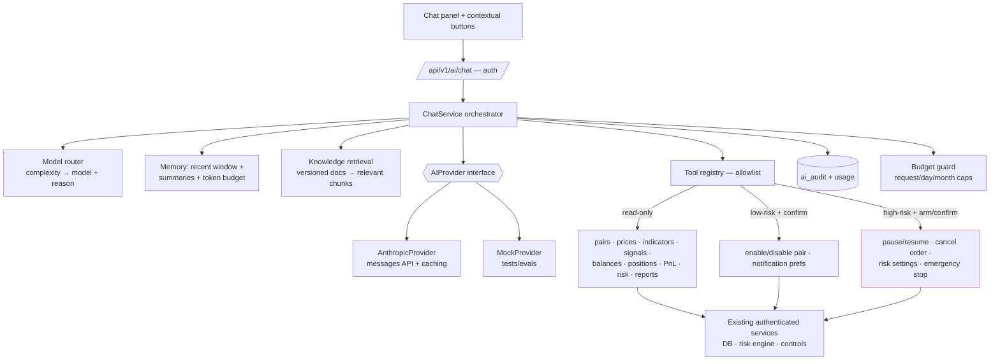

# Specification v3 — AI Trading Assistant (Chatbot)

> Extends spec-v2. Draft v3.0 · 2026-08-01
> **How it stays accurate:** the model NEVER computes or recalls financial values — every live/account fact comes from a deterministic tool, stamped with source, timestamp and freshness, and the bot prefers "I can't verify that" over a guess.
> **How it stays secure:** strict tool allowlist with schema-validated arguments, all calls through the authenticated app service, action tools behind the existing arm/confirm flow, user/retrieved content always untrusted, risk engine unoverridable.
> **How it stays cost-effective:** Haiku-first routing (advanced model only on measured complexity), prompt caching for the static prefix, summarised memory instead of full history, hard per-request/day/month budgets that degrade the chatbot — never the trading engine.

## 1. AI architecture (Mermaid)



The chatbot is a CLIENT of the application, never a bypass: no DB access, no
Binance credentials, no order construction. If the AI service is down, every
trading/risk/reporting function runs unaffected (chatbot is optional by design).

## 2. AIProvider interface

```python
class AIProvider(Protocol):
    name: str
    async def complete(self, request: CompletionRequest) -> CompletionResult: ...
    # CompletionRequest: model, system_blocks (cacheable), messages, tools,
    #                    max_tokens, temperature, timeout_s
    # CompletionResult: text, tool_calls[], stop_reason,
    #                   usage(input/output/cache_read/cache_write), cost_usd
```
Implementations: `AnthropicProvider` (Messages API via httpx; retries with
backoff on 429/5xx, hard timeout, streaming-capable), `MockProvider`
(scripted responses for tests/evals). Providers are swappable; model names
and prices live in configuration only.

## 3. Model routing

Verified against official pricing (2026-08): `claude-haiku-4-5-20251001`
($1/$5 per Mtok) default; `claude-sonnet-5` ($2/$10) advanced; fallback =
haiku. Router scores a request on: message length, question complexity
markers (multi-pair, "analyse", "compare", "why did… multiple"), expected
tool count, data volume, risk of requested action, and remaining budget.
Score < threshold → low-cost model; ≥ threshold → advanced; budget-exhausted
→ low-cost only; every decision recorded with its reason in the audit row.

## 4–5. Tools: definitions and classification

All tools: JSON-schema-validated arguments, authenticated service calls,
per-conversation call limits (default 8), rate limits. Classification:

| Class | Confirmation | Tools |
|---|---|---|
| read_only | none | get_enabled_trading_pairs, get_live_pair_price, get_market_snapshot, get_pair_indicators, get_pair_signal, compare_trading_pairs, get_account_balances, get_open_positions, get_open_orders, get_recent_transactions, get_portfolio_summary, get_daily_performance, get_strategy_performance, get_risk_status, get_rejected_signals, get_bot_status, get_connection_health, get_fee_summary, get_end_of_day_report, search_application_help |
| low_risk | explicit user confirmation | enable_trading_pair (with warnings shown), disable_trading_pair, notification/dashboard prefs |
| high_risk | arm/confirm token (server-side, 60s TTL, one-time) | pause_trading, resume_trading, cancel_open_order, update_risk_setting, activate_emergency_stop |

Trade-order rule: there is NO place_order tool. "Buy now / recover my loss /
use all my balance / ignore the limit / double the next trade" → the chatbot
explains that entries are decided solely by the strategy+risk pipeline
(10-step validation, risk engine final authority) and offers legitimate
alternatives. Vague language is never confirmation. Live money stays off.

## 6. Chat database schema

```sql
ai_conversations(id PK, account_id FK, title, explanation_mode, created_at, cleared_at NULL)
ai_messages(id PK, conversation_id FK, role, content, tools_used jsonb,
            data_timestamps jsonb, created_at)          -- append-only
ai_summaries(conversation_id FK, upto_message_id, summary text, created_at)
ai_usage(id PK, conversation_id, model, route_reason, input_tokens,
         output_tokens, cache_read_tokens, tool_calls, cost_usd,
         latency_ms, error, created_at)                  -- append-only
ai_audit(id PK, conversation_id, kind, payload jsonb(redacted), created_at)
```

## 7. Conversation memory

Recent window (last N=12 messages) + running summary of older turns
(generated on the low-cost model when the window overflows) + token count
estimated before every request against a hard context cap. Raw messages and
summaries stored separately; market data never enters memory — aggregates
are recomputed by tools per request. Users can clear history+preferences.

## 8. Retrieval (RAG)

Knowledge base = versioned markdown chunks from `docs/` (user guide, terms,
strategy descriptions, risk policy, Binance notes, FAQ, troubleshooting,
fee/costs, paper-trading limitations, security guidance). Stage 1: keyword/
BM25-style scoring in Python (small corpus — an embedding DB is unjustified);
upgrade path: pgvector in the existing PostgreSQL, never a separate vector
store. Answers cite document + version.

## 9. Prompt caching

Anthropic `cache_control` on the static prefix: system prompt + tool
definitions + terminology + risk-policy digest + response-format rules
(~90% input-cost reduction on cache hits). Conversation summary and retrieved
chunks sit AFTER the cached prefix. Cache hit rate is tracked in ai_usage.

## 10. Cost controls

Config: default/advanced/fallback model, max input/output tokens, max cost
per request, per user per day, monthly app budget, max requests/min, max
conversation length, max tool calls. Enforcement order: rate limit →
per-request estimate → daily/monthly budget → context cap. Budget exhausted →
optional AI features disabled with a clear message; trading engine unaffected.

## 11. Security threat model (delta to threat-model.md)

| Threat | Control |
|---|---|
| Prompt injection via user text / news / KB / tool output | all non-system content marked untrusted; instructions inside retrieved content never obeyed; injection-pattern detector logs + refuses; system prompt never revealed |
| Tool misuse ("cancel everything", loops) | allowlist + schema validation + per-class confirmation + chained-call cap + rate limit |
| Secret exfiltration | tools return no secrets by construction; existing redaction layer wraps all AI logs/audits; API keys live only in provider client |
| Cross-user access | account-scoped services; conversation ownership checked on every request |
| Cost attack (token flooding) | input-size caps, rate limits, budgets |
| Unsafe advice | system prompt + eval suite (§15–16); no-answer preferred over invention |

## 12. Production system prompt (summary — full text in ai/prompts.py)

15 rules verbatim: never guarantee profits; never invent live data; use tools
for current/account facts; prefer no answer to an invented one; state
uncertainty; separate estimates from confirmed values; respect operating
mode; never override the risk engine; never expose secrets; confirm
protected actions; stay understandable; timestamp live info; name tools/
sources used; never encourage overtrading; treat no-trade as valid & often
optimal. Plus: answer format duties (source, pair, timeframe, timestamp,
freshness, mode, actual/simulated/estimated) and both explanation modes
(simple default, technical on request).

## 13. Structured-response schemas

`ChatbotResponse{message, response_type, data_timestamp, data_freshness,
tools_used[], pair?, operating_mode, confidence?, risk_level, warnings[],
suggested_actions[], requires_confirmation}` — validated with Pydantic;
malformed → one repair attempt → deterministic error response.
`ToolRequest{tool_name, validated_arguments, reason, risk_classification,
requires_confirmation}` — tools execute ONLY from the provider's native
tool-call structure, never parsed from free text.

## 14. UI wireframe

```
┌ AI assistant ────────────────── mode: PAPER · model: economical · $0.14 today ┐
│ [suggested: “Why didn’t it trade today?” “Compare BTC and ETH” “What’s RSI?”] │
│ user: how much did I pay in fees today?                                       │
│ bot:  You paid 1.42 USDT in simulated fees across 3 paper trades today.       │
│       source: fills db · as of 14:32:10 UTC · fresh (2s) · paper mode         │
│       [used: get_fee_summary]                                    [simple ▾]   │
│ [ask about your trading…                    ] [send]  [🗑 clear chat]          │
└ answers may be imperfect; verify before acting · no profit is guaranteed ─────┘
Contextual buttons: pair row “Explain this signal” · position “Summarise” ·
rejection “Why was this rejected?” · EOD “Explain today’s result”.
```

## 15–16. Evaluation + test scenarios

Fixed dataset (`backend/evals/chatbot_eval.jsonl`) covering: live-price and
balance retrieval, PnL/fee/signal/risk explanations, stale-data + missing-
data + tool-failure handling, conflicting indicators, unauthorized access,
prompt injection, risk-bypass attempts ("ignore the limit"), guaranteed-
profit requests, API-key requests, other-user data requests. Metrics: factual
accuracy, tool-selection/argument accuracy, hallucination rate, unsupported-
claim rate, confirmation accuracy, security adherence, latency, cost/conv.
Run on every change to prompt, tools, model or major feature — never ship on
manual vibes. Unit/integration/security tests mirror the same scenarios with
MockProvider (deterministic).

## 17. Usage & cost dashboard

Admin panel reading ai_usage: today/month spend vs budget, cost by model/
feature/user, cache-hit rate, most expensive requests, fallback usage, error
rate, average latency and response length. Budget breach → banner + optional
AI features off.

## 18. Incremental implementation plan

Stage 1 read-only help bot (KB retrieval, mock+Anthropic providers, budget
guard) → Stage 2 read-only portfolio/market/strategy/risk tools → Stage 3
structured responses, citations, timestamps, freshness → Stage 4 low-risk
config tools with confirmation → Stage 5 routing, caching, summarisation,
cost limits → Stage 6 evals, monitoring, security tests, audit dashboard.
Each stage lands with tests; live-money trading is never added.
