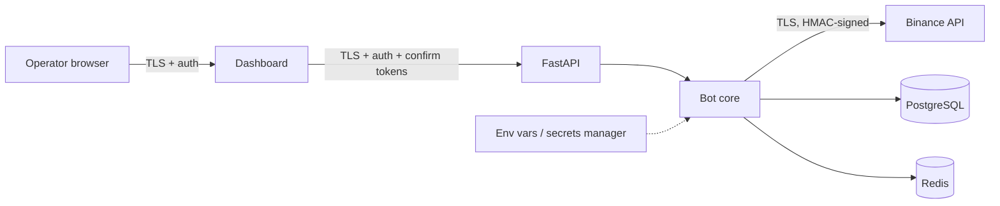

# Threat Model — CryptoBot

> Draft v1.0 · 2026-08-01 · Methodology: STRIDE + trading-specific abuse cases
> Assets at risk: **API keys**, **allocated capital**, **market/trade data integrity**, **operator dashboard access**, **audit trail integrity**.

## 1. Trust boundaries

Boundaries: browser↔API, API↔core, core↔Binance, core↔datastores, secrets↔process.

## 2. Threats and controls

| ID | Threat (STRIDE) | Vector | Controls |
|----|-----------------|--------|----------|
| T1 | API-key theft (I) | keys in code, repo, logs, tracebacks | env/secrets-manager only; `.env` gitignored; `.env.example` placeholders; logging filter redacts keys/signatures/signed URLs incl. exception traces; pre-commit secret scan (gitleaks); CI secret scan |
| T2 | Key abuse if stolen (E) | attacker uses leaked key | withdrawals **disabled** on key; least-privilege permissions (spot trade + read only); IP allowlisting; separate testnet/live keys; documented rotation procedure (create new → deploy → verify → revoke old) |
| T3 | Dashboard takeover (S/E) | weak auth, CSRF, exposed port | authenticated single-operator access; high-risk actions need server-issued confirmation token (two-step); dashboard bound to localhost/VPN by default; rate-limited login; CORS locked |
| T4 | Order tampering / spoofed responses (T/S) | MITM, fake exchange responses | TLS with cert verification; HMAC request signing; final state always confirmed via signed query + user-data stream, never trusted from a single response |
| T5 | Duplicate/replayed orders (T) | retries after timeouts, WS event replay | unique client order IDs (DB-unique); query-before-retry rule; unique `(order_id, exchange_trade_id)` on fills; recvWindow + server-time sync |
| T6 | Log/audit tampering (T/R) | attacker or bug rewrites history | append-only tables (UPDATE/DELETE revoked from app role); config/content hashes; correlation IDs |
| T7 | Malicious/buggy config change (T) | fat-finger risk limits, enable live | config versioning with author + change note; live gate requires multi-step independent factors (risk-policy §9); prohibited behaviors hard-coded, not configurable |
| T8 | Dependency compromise (T/E) | typosquatting, malicious update | pinned dependencies with lock file; CI vulnerability scan (pip-audit); minimal image; no dynamic code loading |
| T9 | Poisoned market data (T) | bad feed → bad trades | staleness detection; cross-check WS vs REST snapshots on anomaly; abnormal-volatility guard; anomaly detection (Phase 5) |
| T10 | DoS of bot host (D) | resource exhaustion, WS floods | rate limiting, bounded queues, backpressure; fail-closed: on overload, stop opening positions |
| T11 | Secrets in DB/backups (I) | config table or dumps leak keys | secrets never stored in DB or config_versions; backups contain no secrets by construction |
| T12 | Insider/operator error (R) | accidental live enable, wrong size | live disabled by default; multi-step gate; max order value; small capital cap; every manual action audited with actor identity |
| T13 | Credential misconfiguration (E) | wrong permissions, expired key | fail-closed startup check: verify key permissions (must NOT include withdrawal), verify mode↔credential match, halt if invalid |

## 3. Security requirements checklist (Phase 6 gate)

- [ ] No hard-coded secrets anywhere (automated scan clean)
- [ ] `.env` in `.gitignore`; repo history free of secrets
- [ ] Live key: withdrawals disabled, least privilege, IP allowlisted — verified via API at startup
- [ ] Redaction filter proven by test: keys/signatures never appear in logs or tracebacks
- [ ] Key rotation runbook tested end-to-end
- [ ] Testnet and live credentials fully separated (different env vars, never both loaded)
- [ ] Live gate factors independently verified (config, env var, credentials, DB record, CLI confirm)
- [ ] Emergency stop cancels all orders and blocks new ones (drill passed)
- [ ] Fail-closed on invalid credentials/permissions (test passed)
- [ ] Dependency and container vulnerability scans clean
- [ ] Dashboard auth + confirmation-token flow penetration-checked
- [ ] Backups verified to contain no secrets; restore drill passed

## 4. Non-threats / accepted risks

- Binance itself being compromised or insolvent — out of scope; mitigated only by small capital allocation.
- Sophisticated nation-state attacker on the operator's machine — out of scope for a single-operator system.
- Market risk — not a security threat; handled by `risk-policy.md`.
